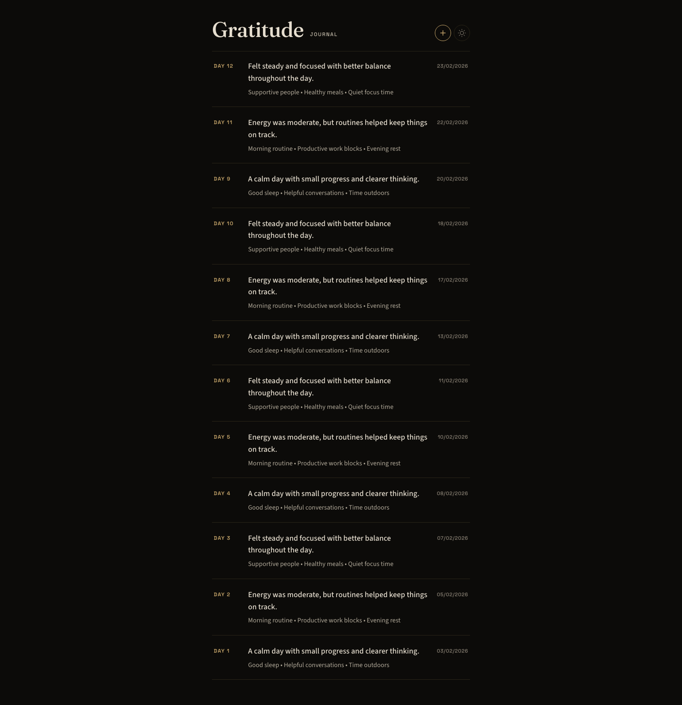
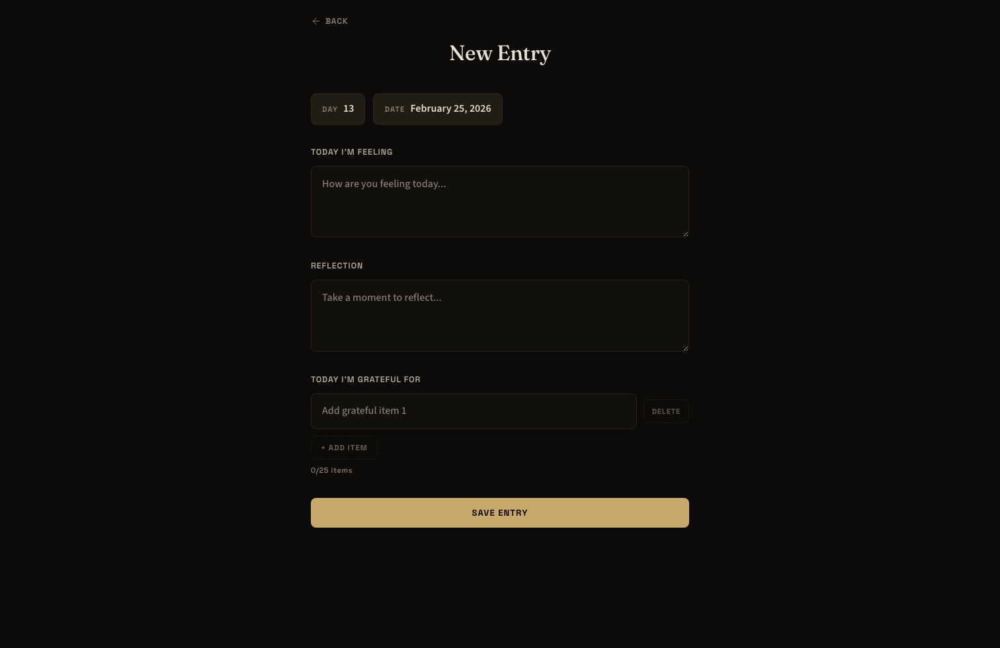

# Gratitude Journal

A minimal dark-themed gratitude journal app that stores entries in Notion.

Each entry captures:
- **Day number & date**
- **How you're feeling**
- **An AI-generated reflection question**
- **What you're grateful for**

## Setup

### 1. Create a Notion Integration

1. Go to [notion.so/my-integrations](https://www.notion.so/my-integrations)
2. Click **New integration**
3. Name it (e.g. "Gratitude Journal"), select your workspace
4. Copy the **Internal Integration Secret** (`secret_...`)

### 2. Connect Integration to Your Page

1. Open your **Gratitude Journal** page in Notion
2. Click the `...` menu (top right) → **Connections** → Add your integration
3. Copy the **Page ID** from the URL — it's the 32-character hex string after the page name:
   ```
   https://notion.so/Gratitude-Journal-abc123def456...
                                        ^^^^^^^^^^^^^^^^ this part
   ```

### 3. Configure Environment

```bash
cp .env.example .env
```

Fill in your values:
```
NOTION_API_KEY=secret_your_key_here
NOTION_PAGE_ID=your_page_id_here
PORT=3000
```

### 4. Install & Run

```bash
npm install
npm start
```

Open [http://localhost:3000](http://localhost:3000)

## Usage

- **Home** — Lists all entries sorted by date
- **+ button** — Create a new entry
- **Click an entry** — View full details
- **Edit / Delete** — Available on each entry's detail view

The app automatically creates a "Gratitude Entries" database inside your Notion page on first use.

## Screenshots

### Home (Entries List)



### Add New Entry



## Tech Stack

- **Frontend:** HTML, CSS, vanilla JS
- **Backend:** Node.js, Express
- **Storage:** Notion API (`@notionhq/client`)
