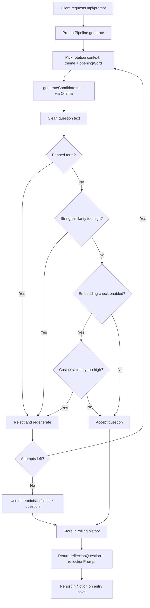

# Prompt Pipeline Library

This folder contains a reusable anti-repetition pipeline used by `/api/prompt`.

## Architecture Diagram



## Files
- `promptPipeline.js`: core library with configurable generation/validation steps.

## What The Pipeline Does
1. Rotates deterministic context (`theme`, `openingWord`).
2. Calls a generator function (Ollama in this app).
3. Cleans and validates output.
4. Rejects banned terms.
5. Rejects near-duplicates using string similarity (Jaccard, Dice, Levenshtein).
6. Optionally rejects semantic duplicates with embedding cosine similarity.
7. Regenerates up to `maxAttempts`.
8. Stores accepted questions in rolling history (default: last 50).

## Core Types
- `InMemoryQuestionStore(limit)`: rolling history store.
- `PromptPipeline(config, store?)`: pipeline orchestrator.
- `DEFAULT_PROMPT_PIPELINE_CONFIG`: default settings.
- `similarityUtils`: exported similarity helpers.

## Configurable Steps
Use `config.steps` to enable/disable:
- `rotation`
- `banList`
- `stringSimilarity`
- `embeddingSimilarity`

Other key config:
- `history.limit`
- `generation.maxAttempts`
- `generation.maxWords`
- `rotation.themes`
- `rotation.openingWords`
- `filters.bannedTerms`
- `similarity.stringThreshold`
- `similarity.embeddingThreshold`

## Minimal Usage
```js
const { PromptPipeline } = require("./promptPipeline");

const pipeline = new PromptPipeline();

const result = await pipeline.generate({
  generateCandidate: async ({ theme, openingWord }) => {
    return `${openingWord} did ${theme} change who you became?`;
  },
});

console.log(result.question);
console.log(result.prompt); // Theme: ... | Start with: ...
```

## Repo Integration Notes
- Backend integration lives in `server.js`.
- Generated output currently stores:
  - `ReflectionQuestion`: user-facing question text.
  - `ReflectionPrompt`: pipeline context string (`Theme: ... | Start with: ...`).
- On startup, the server hydrates history from recent Notion entries to keep dedupe effective across restarts.
